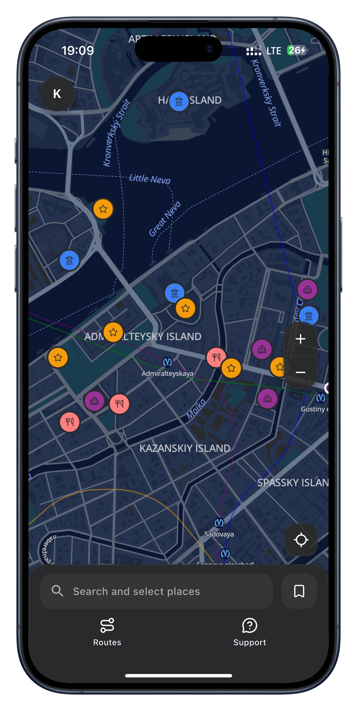
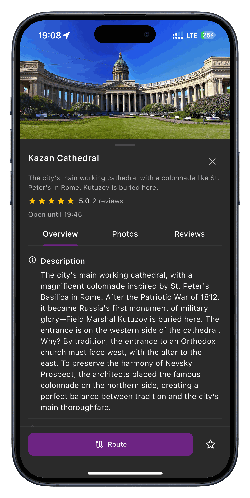
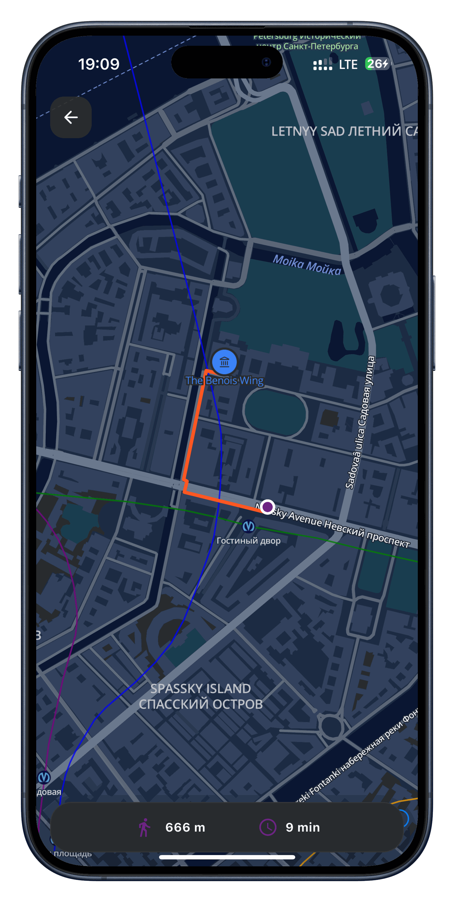
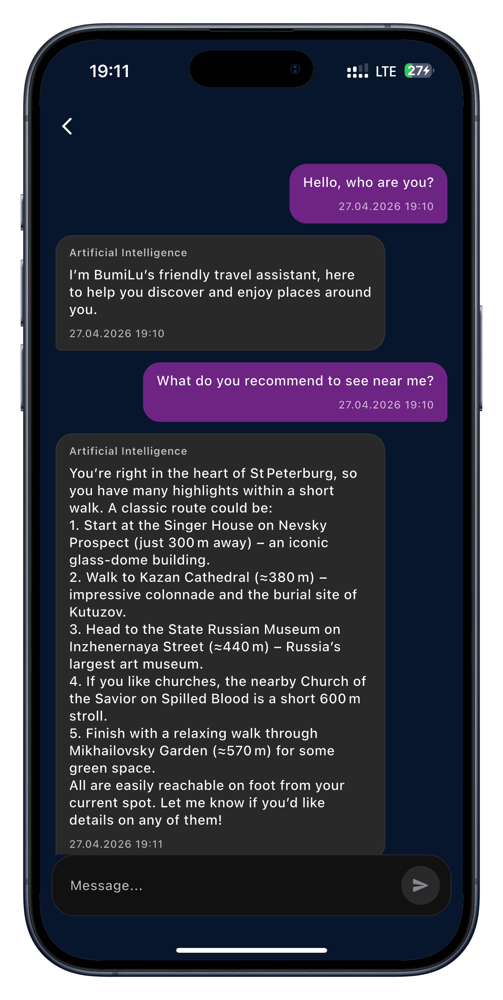

<p align="center">
  
</p>

<h1 align="center">BumiLu Backend</h1>

<p align="center">
  Backend for an MVP of a multilingual travel companion app for Chinese tourists exploring Saint Petersburg — place discovery, route building, and AI-powered recommendations, with no reliance on Russian or English.
</p>

<p align="center">
  🔗 <a href="https://bumilu.ru">bumilu.ru</a>
</p>

## About BumiLu

Chinese tourists account for up to 50% of foreign hotel bookings in Saint Petersburg, and most of them travel independently, with no Russian or English. Existing map services (Yandex Maps, Google Maps, AMap) each cover part of the problem, but none combine multilingual content, a tourist-oriented scenario, and AI-driven recommendations in one product. BumiLu was built to fill that gap: an interactive map with multilingual place data, route building, and a geolocation-aware AI assistant, backed by an admin panel for content management.

Finalist of the ["Basics of Project Activity" SPbPU 2026](https://opd.spbstu.ru/) competition, IT Projects category. The MVP was beta-tested with ~50 users.

<p align="center">
  
  
  
  
</p>

## About This Repository

This repository is the **backend** for BumiLu: the API, business logic, and the CI/CD setup for building and deploying it. The mobile app, admin panel frontend, and landing page were built separately by other team members and aren't part of this repository.

## Tech Stack

- **API**: FastAPI, Python 3.14
- **Persistence**: PostgreSQL + PostGIS, SQLAlchemy 2.0 (async), Alembic migrations
- **Cache / sessions / queues**: Redis, Taskiq (background jobs & scheduler)
- **Maps infra**: [Valhalla](https://github.com/valhalla/valhalla) (routing, in this repo), [TileServer GL](https://github.com/maptiler/tileserver-gl) (separate repository, not included here)
- **DI**: Dishka
- **Observability**: structured logging, Prometheus (`prometheus-fastapi-instrumentator`)
- **Containerization & CI**: Docker / Docker Compose, GitHub Actions
- **API gateway**: Traefik, Kong (separate repository, not included here)
- **Testing**: pytest, testcontainers
- **Code quality**: ruff, mypy, pre-commit

## Architecture

The codebase follows DDD-flavored layering with CQRS on the application layer. Every module under `app/modules/<name>` has the same internal structure:

- `domain` — entities, value objects, domain exceptions; no framework or infrastructure dependencies
- `application` — commands, queries, handlers, and interfaces (ports) that infrastructure implements
- `infrastructure` — SQLAlchemy repositories, Redis-backed stores, external clients (adapters implementing the application ports)
- `presentation` — FastAPI routers, request/response schemas, DI wiring

Cross-cutting concerns (base exceptions, DB session/transaction handling, logging, config, DI container setup) live in `app/core`.

Modules: `auth`, `chat`, `favourites`, `places`, `reviews`, `routes`, `routing`, `staff`, `stats`, `users`.

## API

~90 endpoints across 10 modules, each split into a user-facing and an admin-facing router. Full interactive reference: `/docs/swagger` or `/docs/redoc` once the app is running.

| Module | What it covers |
|---|---|
| `auth` | Guest login, passwordless email OTP login, staff email+password login, session refresh/logout (see [Authentication & Access Control](#authentication--access-control)) |
| `places` | User: browse/search places, categories, map POIs, place details. Admin: full CRUD on places, categories, translations, phone numbers, photos, working hours, publish/unpublish status |
| `routes` | User: browse curated routes, get walking directions for one. Admin: full CRUD on routes, route points, translations, publish status |
| `routing` | On-demand walking/driving directions between arbitrary points, backed by Valhalla |
| `chat` | User: conversation with the AI travel assistant. Admin: view conversations and reply to ones the AI couldn't handle |
| `reviews` | Leave, view, edit, and delete reviews on a place or a route |
| `favourites` | Save, remove, and list favourite places and routes |
| `users` | Current user's profile, favourites, and reviews |
| `staff` | List/create staff members, current staff profile |
| `stats` | Admin dashboard aggregate stats |

### Authentication & Access Control

Two principal types: **User** (mobile/web app end users) and **Staff** (internal admin panel).

- **User login** — two methods:
  - **Guest** — anonymous, device-bound session, no credentials required.
  - **Email OTP** — passwordless: request a one-time code by email, then verify it to get a session.
- **Staff login** — email + password. If no staff member exists yet, the first successful `POST /v1/auth/staff/login` call bootstraps that account as `OWNER` — there's no separate registration step or seed script.

Both flows issue a short-lived JWT access token plus a server-side, revocable refresh session (rotated on every refresh). Delivery differs by client: user refresh tokens are returned in the response body (mobile app), staff refresh tokens are set as an `httpOnly` cookie (web admin panel) — a deliberate split, not an inconsistency.

Admin routes are gated by a "is this a staff principal" check. Staff roles (`OWNER` / `ADMIN` / `SUPPORT`) exist in the domain model but aren't yet enforced per-endpoint — any authenticated staff member can currently reach any admin route.

## Getting Started

Prerequisites: Docker and Docker Compose.

1. **Clone**

   ```bash
   git clone https://github.com/Belyashik2K/bumilu-backend.git
   cd bumilu-backend
   ```

2. **Configure environment**

   ```bash
   cp .env.example .env
   ```

   Fill in real values for SMTP credentials, JWT/OTP secret keys, and S3 credentials. An OpenAI/OpenRouter API key is only needed if you want to exercise the chat assistant module.

3. **Create the shared external network**

   ```bash
   docker network create bumilu
   ```

4. **Run**

   ```bash
   docker-compose --env-file .env -f deploy/docker-compose.dev.yml -f deploy/docker-compose.yml up --build
   ```

   The `migrations` service applies Alembic migrations automatically before the API starts. The `valhalla` (routing) service is **not** started by default — see [Routing](#routing-optional) — so the rest of the API works out of the box without it; routing endpoints will just respond with a 503 until it's enabled.

5. **API docs**: `http://localhost:8000/docs/swagger` (Swagger) or `http://localhost:8000/docs/redoc` (ReDoc).

6. **(Optional) Seed data** — `stubs/temp_places_and_routes_data.sql` has sample places/categories/routes for local exploration. Copy it into the running Postgres container and apply it with `psql`.

### Routing (optional)

Routing is powered by a self-hosted [Valhalla](https://github.com/valhalla/valhalla) instance, which needs pre-built map tiles — too large to commit to the repo. To enable it:

1. Download the prebuilt tiles from [Yandex Disk](https://disk.yandex.ru/d/hie896H1tC0wlA) and extract the contents into `valhalla_data/` at the repo root.
2. Start the stack with the `routing` profile and the routing override enabled:

   ```bash
   docker-compose --env-file .env -f deploy/docker-compose.dev.yml -f deploy/docker-compose.yml -f deploy/docker-compose.routing.yml --profile routing up --build
   ```

Without this, everything else (auth, places, favourites, reviews, chat, etc.) works normally — only the `routing` module's endpoints are unavailable.

## Testing

```bash
pytest -m "not integration"   # unit tests only, no external services required
pytest                        # full suite; spins up a Redis container via testcontainers (needs Docker)
```

## Known MVP Limitations

- **No per-role authorization for staff.** Staff roles (`OWNER` / `ADMIN` / `SUPPORT`) exist in the domain model, but admin endpoints only check "is this a staff principal", not the specific role.
- **First-staff-login bootstrap has no safeguard.** Whoever calls `POST /v1/auth/staff/login` first becomes `OWNER` — fine for a controlled first deploy, but it's a race if the admin panel is ever exposed before that first login happens.
- **No retry/backoff on external calls** (SMTP, S3, routing service). A transient failure of an external dependency currently fails the request instead of being retried.
- **No application-level caching.** Caching for map/place lookups was handled at the gateway layer (`Traefik → Kong`), not in application code.
- **Test coverage** is currently limited to the domain and part of the application layer (`tests/unit`), plus one infrastructure integration test against a real Redis instance (`tests/integration`). E2E flows were covered manually during development, not by automated tests.

## Project Status

This project is **archived and no longer under active development**. Published as-is for
reference; issues and PRs may not be reviewed.

## License

[MIT License](LICENSE)
